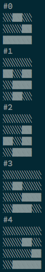

# :seedling: Conways-Game-of-Life

Code created in response to this brief: [PDF](bacteria.pdf).

### Simulator

The simulator script accepts input from the command line and runs 1 evoution of life:

1. Run `node simulator.js`
2. Enter a single coordinate, e.g. 1,2
3. Repeat step 2 as many times as you like
4. Terminate by entering -1,-1

Optionally run `node simulator.js grid 5` to run 5 evolutions of life outputting a grid of the dish cells at each evolution.

### Tests

1. Install [Mocha](https://github.com/visionmedia/mocha) `npm install -g mocha`
- Run `mocha tests`

#### Example: Glider

Enter:

    0,1
    1,2
    2,0
    2,1
    2,2
    -1,-1

